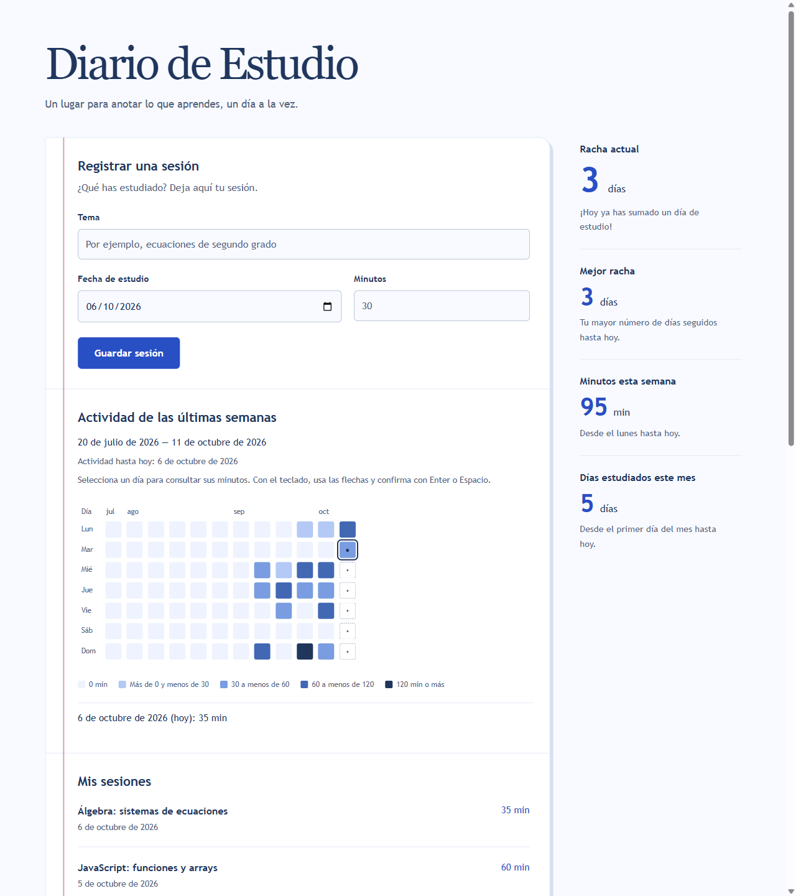
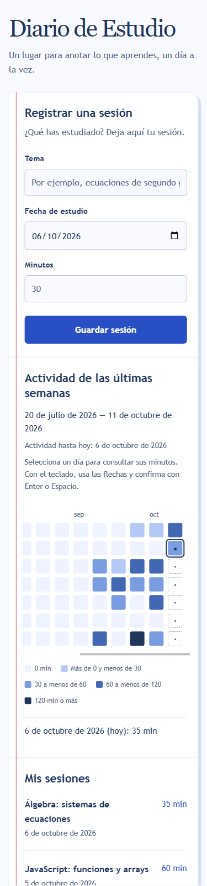

# Diario de Estudio · desarrollo asistido por IA

Aplicación educativa para registrar sesiones de estudio y visualizar la constancia. **Proyecto de portfolio centrado en dirigir y verificar un proceso de desarrollo con IA:** requisitos, especificaciones, planificación, implementación, pruebas y revisión en navegador.

**[Probar la demo](https://horjel.github.io/MyStudyDiary/)** · [Especificación del mapa de calor](specs/001-heat-map/spec.md) · [Tests](tests/)

## Qué demuestra este proyecto

- **Trabajo con IA guiado por requisitos:** reglas explícitas, alcance aprobado y criterios de aceptación antes de implementar el mapa de calor.
- **Criterio técnico:** fechas del calendario local, separación entre cálculos e interfaz y protección del historial ante errores.
- **Validación del resultado generado:** tests automáticos y comprobaciones reales con Chrome DevTools, teclado y vista móvil.
- **Corrección con evidencia:** una auditoría encontró dos fallos que los tests existentes no detectaban; se añadieron pruebas que fallaron antes de corregir el código.
- **Mantenimiento accesible:** HTML, CSS y JavaScript puros, sin dependencias de ejecución ni compilación de la aplicación.

## Resultado



<details>
<summary>Ver la captura móvil (375 px)</summary>



</details>

Las capturas usan sesiones ficticias en un contexto de navegador aislado. La demo empieza sin sesiones; no carga un historial de ejemplo automáticamente.

### Funcionalidades

- Registrar fecha de estudio, tema y duración, también con minutos decimales.
- Consultar racha actual y mejor racha; una racha que termina ayer sigue activa.
- Ver minutos desde el lunes hasta hoy y días distintos estudiados durante el mes.
- Consultar un mapa de doce semanas con cinco niveles de actividad según minutos diarios.
- Seleccionar fechas mediante ratón, toque o teclado, con detalle textual de la actividad.
- Guardar sesiones en el navegador y recuperarlas al recargar.

## Mi participación y el papel de la IA

Este proyecto se desarrolló **con asistencia sustancial de IA mediante OpenCode**. La IA participó en la documentación, las propuestas técnicas, la escritura de código y tests, y las verificaciones con herramientas. No se presenta como código escrito íntegramente de forma manual.

**Mi participación:** planteé las funcionalidades y el contexto educativo, aprobé el alcance y las propuestas, solicité revisiones de QA y comprobaciones de conformidad, señalé problemas visibles y confirmé las pruebas manuales de lector de pantalla y retorno a la página. Algunas decisiones técnicas se delegaron explícitamente al asistente.

**El objetivo del portfolio:** mostrar cómo conduzco un trabajo con IA, exijo evidencias y reviso sus resultados. El repositorio permite examinar tanto el producto como el proceso; no pretende demostrar que todo se implementó sin asistencia.

### Un ejemplo: no dar por terminado lo que solo parece funcionar

La primera batería del mapa pasaba **22 tests**, pero una revisión criterio por criterio encontró dos problemas en «Ver total completo»:

1. Tras cambiar la fecha, el control podía consultar un total del periodo anterior.
2. Si aparecía un error, el foco podía quedarse en el control oculto.

Se escribieron pruebas de regresión que reprodujeron los fallos, se corrigió la actualización previa a la consulta y la gestión del foco, y se repitieron los escenarios en Chrome. Después se amplió la cobertura de cambios de zona horaria y reanudación simulada.

**Aprendizaje:** una batería de tests verde no sustituye la revisión de requisitos ni la interacción real con la interfaz.

## Cómo se organizó el desarrollo con IA

| Documento | Qué permite revisar |
| --- | --- |
| [Constitución](docs/constitution.md) | Los seis principios del proyecto: simplicidad, especificación, separación, tests, datos e idioma. |
| [Instrucciones del proyecto](AGENTS.md) | Las reglas que debe respetar el asistente al trabajar sobre el código. |
| [Spec](specs/001-heat-map/spec.md) | El qué y el porqué del mapa, con RF y criterios de aceptación en español. |
| [Plan](specs/001-heat-map/plan.md) | Responsabilidades, algoritmos, decisiones y alternativas descartadas. |
| [Tareas y evidencias](specs/001-heat-map/tasks.md) | Trabajo desglosado y registro de auditorías, fallos, correcciones y verificaciones. |
| [Skill de fechas locales](.opencode/skills/local-dates/SKILL.md) | Guía reutilizable para evitar errores de calendario al trabajar con IA. |
| [Memoria](MEMORY.md) | Estado actual, decisiones y errores que no deben repetirse. |

La documentación registra la evolución previa a la publicación. El historial Git comienza con una importación inicial del proyecto; no reconstruye retrospectivamente cada paso de desarrollo.

## Ejecutar y probar

### Aplicación

Descarga o clona el repositorio y abre **`index.html`** en un navegador moderno. No necesita instalar paquetes, levantar un servidor ni compilar.

También puedes usar la [demo pública](https://horjel.github.io/MyStudyDiary/).

### Tests

Con Node.js instalado, ejecuta desde la raíz:

```sh
node --test
```

**Última verificación: 26 tests correctos, 0 fallos, con Node.js 24.** Se utilizan las herramientas nativas de Node, sin instalar dependencias.

- [Tests de lógica](tests/study-logic.test.cjs): calendario, validación, suma decimal exacta, umbrales, formato y regresión de indicadores.
- [Tests de integración](tests/app.test.cjs): almacenamiento y reloj controlados, errores, foco, actualización y cambios de zona horaria.
- Verificación complementaria en Chrome: `file://`, guardado/recarga, teclado, estados de error, capturas y ancho móvil de 375 px.
- Las pruebas de anuncios con lector de pantalla y retorno real a la página fueron confirmadas manualmente por el autor; no se presentan como pruebas automatizadas.

Los dobles de DOM usados en Node prueban coordinación, no renderizado ni anuncios reales de un lector de pantalla.

## Estructura

```text
index.html       Estructura y controles accesibles
styles.css       Diseño de cuaderno y adaptación móvil
study-logic.js   Funciones puras de fechas, estadísticas y mapa
app.js           Interfaz, eventos, reloj y almacenamiento
tests/           Pruebas nativas de Node
docs/            Constitución y capturas
specs/           Especificación, plan, tareas y evidencias
```

## Decisiones que merece la pena inspeccionar

- **Fecha local explícita:** los cálculos reciben `today`; no usan conversiones UTC para decidir el día de estudio.
- **Decimales exactos para el mapa:** acumulación con coeficientes enteros y escala decimal en memoria; los datos guardados conservan su formato original.
- **Errores distintos:** una lectura inválida bloquea nuevas escrituras para proteger el historial; un total demasiado grande no invalida las sesiones ni impide guardar.
- **Accesibilidad:** información también textual, navegación por teclado, separación entre foco y selección, y días futuros no activables.
- **Sin dependencias de ejecución:** scripts clásicos para conservar la apertura por doble clic. Las herramientas del asistente no son dependencias de la aplicación.

## Alcance y límites

Es un proyecto educativo de portfolio, no un servicio con cuentas de usuario. No incluye backend, sincronización, exportación ni edición/borrado de sesiones desde el mapa.

Las sesiones se guardan en **localStorage del navegador**: no se envían a un servidor. La demo y la apertura local tienen almacenamientos separados. Borrar los datos del navegador elimina las sesiones de ese origen; no existe copia de seguridad ni sincronización entre dispositivos. La coordinación entre varias pestañas está fuera del alcance de esta versión.

La revisión y las pruebas documentadas corresponden principalmente a Chrome. El diseño se comprobó en escritorio y a 375 px; eso no equivale a certificar todos los navegadores o dispositivos.
